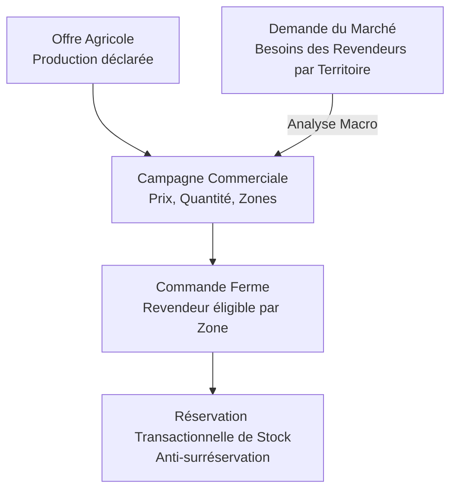

# CONTEXTE GLOBAL DU PROJET (PROJECT_CONTEXT.md)
*Plateforme Numérique B2B de Mise en Relation et d’Intelligence du Marché Agricole*
*Statut du document : Version 1.0 — Cadrage V1 Expérimentale*
*Date : 2026-09-09*

---

## 1. VISION STRATÉGIQUE GLOBALE

Le secteur agricole en Afrique subsaharienne — et particulièrement en République Démocratique du Congo (RDC) — souffre d'un manque criant de structuration de l'information entre les zones de production rurale et les bassins de consommation urbains. Cette asymétrie d'information engendre :
* D'importantes pertes post-récolte pour les producteurs faute de débouchés planifiés ;
* Des pénuries et une volatilité brutale des prix pour les distributeurs et revendeurs dans les grands centres de consommation ;
* Une incapacité pour les entreprises agricoles d'anticiper la demande solvable des marchés cibles.

**L'objectif stratégique à long terme** de la plateforme est de bâtir une infrastructure numérique de référence permettant :
1. De répertorier et valoriser l'offre agricole réelle (exploitations, productions, lots récoltés) ;
2. De centraliser et analyser la demande émanant des revendeurs, grossistes et transformateurs ;
3. De planifier et sécuriser la distribution au moyen de campagnes commerciales ciblées par zone géographique ;
4. De fiabiliser les engagements commerciaux par la commande ferme et la traçabilité des réservations ;
5. De constituer un historique structuré de données de marché afin d'alimenter, à maturité, des outils statistiques, prédictifs et d'intelligence décisionnelle.

> **Référence documentaire** : Le document *"Cahier des charges plateforme agricole.docx"* constitue la boussole stratégique et la vision cible pluriannuelle.

---

## 2. OBJECTIF ET CADRAGE STRICT DE LA V1 EXPÉRIMENTALE

Bien que le cahier des charges décrive un écosystème complet (paiements intégrés, abonnements, quotas, QR codes, logistique multi-étapes, IA prédictive, mobile natif), **l'implémentation actuelle est STRICTEMENT circonscrite à une V1 expérimentale**.

### La boucle de valeur V1
La V1 vise à valider empiriquement la première boucle transactionnelle et relationnelle complète de la filière :



### Bénéfices mesurables de la V1 :
1. **Pour l'entreprise agricole** :
   * Créer son compte et valoriser son profil d'entreprise ;
   * Configurer son catalogue de produits agricoles ;
   * Enregistrer ses productions avec visuels et caractéristiques réelles ;
   * Publier ses productions vers le marché ;
   * Observer la demande agrégée exprimée par les revendeurs (par pays / province), y compris dans des zones non encore desservies pour orienter sa stratégie ;
   * Lancer des campagnes commerciales ciblées (quantité commercialisable, prix unitaire, période, provinces desservies) ;
   * Recevoir les commandes fermes et suivre en temps réel le stock restant versus le stock réservé.
2. **Pour le revendeur** :
   * Créer son compte en déclarant avec précision son territoire d'opération (pays, province/région, ville) ;
   * Parcourir le flux (feed) des productions agricoles publiées et consulter les fiches détaillées ;
   * Découvrir les entreprises agricoles via leur profil public vérifiable ;
   * Exprimer ses besoins prévisionnels (demandes de produits et volumes par zone) ;
   * Découvrir les campagnes commerciales ouvertes ;
   * Passer commande si son territoire fait partie des zones desservies par la campagne ;
   * Suivre l'état d'avancement de ses commandes.

---

## 3. LES ACTEURS DU SYSTÈME V1

| Acteur | Rôle et Responsabilités V1 | Accès applicatif |
| :--- | :--- | :--- |
| **Entreprise Agricole (`company`)** | Structure productrice (ferme, coopérative, agro-industrie). Déclare ses produits, ses productions, consulte la demande globale, publie des campagnes, valide et prépare les commandes. | `/dashboard/company` |
| **Revendeur (`reseller`)** | Acheteur professionnel (grossiste, demi-grossiste, détaillant, transformateur). Exprime des demandes, consulte le feed d'offres, passe commande sur les campagnes éligibles. | `/dashboard/reseller` |
| **Administrateur (`admin`)** | Modérateur et garant du bon fonctionnement de la plateforme. Supervision des entreprises, revendeurs, produits, productions, campagnes et commandes (supervision simple V1). | `/dashboard/admin` |

---

## 4. LES 5 CONCEPTS MÉTIER FONDAMENTAUX (NE PAS CONFONDRE)

La plateforme repose sur 5 piliers conceptuels strictement distincts dans les modèles de données et la logique applicative :

### 1. Demande du Revendeur (`Demand`)
* **Définition** : Expression d'un besoin prévisionnel d'approvisionnement formulé par un revendeur sur un produit, un volume et un territoire donnés (ex. : *100 tonnes de Maïs blanc au Kasaï pour le mois prochain*).
* **Propriétés** :
  - N'est **pas** une commande ;
  - Ne réserve **aucun** stock ;
  - Ne crée **aucun** engagement financier ou juridique immédiat ;
  - Permet aux producteurs et à la plateforme de cartographier la demande solvable et les tensions de marché.

### 2. Production (`Production`)
* **Définition** : Déclaration agronomique par une entreprise d'une culture en cours ou récoltée (ex. : *Parcelle Nord, Maïs variété X, récolte estimée à 500 tonnes en novembre*).
* **Propriétés** :
  - Liée à une entreprise et un produit du catalogue ;
  - Comprend descriptif, photo principale, volume attendu, période et localisation de culture ;
  - N'est **pas** automatiquement une offre commerciale ;
  - Une production peut exister sans être mise en vente immédiate.

### 3. Campagne Commerciale (`Campaign`)
* **Définition** : Offre de mise en marché active formulée par une entreprise agricole sur la base d'une production existante.
* **Propriétés** :
  - Définit un volume commercialisable dédié (qui ne peut dépasser le stock de la production) ;
  - Fixe un prix unitaire ferme, une devise (ex. : USD) et une période de disponibilité ;
  - **Spécifie explicitement les zones géographiques desservies** (liste des pays et provinces/régions éligibles à la livraison) ;
  - Possède des statuts stricts : `brouillon`, `active` (ouverte aux commandes), `suspendue`, `terminée`, `annulée`.

### 4. Commande (`Order`)
* **Définition** : Engagement commercial formel et ferme passé par un revendeur sur une campagne active dont la zone géographique couvre sa localisation.
* **Propriétés** :
  - Porte sur une quantité précise à un prix unitaire figé au moment de la passation ;
  - Génère immédiatement une réservation de stock sur la campagne ;
  - Dispose d'un cycle de vie propre : `en attente`, `confirmée`, `en préparation`, `prête`, `livrée`, `annulée`.

### 5. Stock / Quantité Réservée (`Stock Reservation`)
* **Définition** : Mécanisme comptable et transactionnel garantissant la cohérence des disponibilités.
* **Propriétés** :
  $$\text{Quantité Restante (Disponible)} = \text{Quantité Commercialisable} - \sum \text{Quantités Réservées des Commandes Valides}$$
  - Toute nouvelle commande tente de réserver une quote-part du stock commercialisable ;
  - Si $\text{Quantité Restante} < \text{Quantité Commandée}$, la commande est systématiquement rejetée côté serveur ;
  - Doit être traitée de manière atomique (isolation transactionnelle PostgreSQL) pour prévenir la double réservation simultanée (race conditions).

---

## 5. LOGIQUE TERRITORIALE ET GÉOGRAPHIQUE V1

La territorialité est le moteur central du ciblage de la plateforme :

### A. Localisation du revendeur
Lors de son inscription, le revendeur doit obligatoirement renseigner :
* **Pays** (ex. : République Démocratique du Congo) ;
* **Province / Région** (ex. : Kinshasa, Kasaï, Kwilu, Kongo-Central) ;
* **Ville** (ex. : Tshikapa, Kananga, Matadi, etc.).

### B. Règle d'éligibilité à la commande
* Une campagne commerciale déclare une liste fermée de territoires desservis (ex. : `[Kinshasa, Kongo-Central]`).
* Le revendeur situé au `Kasaï` voit que la campagne existe mais **ne peut pas commander** : le système affiche clairement l'inadéquation géographique.
* Le revendeur peut en revanche exprimer une **Demande** pour son territoire afin de signaler son intérêt aux producteurs.

### C. Décloisonnement de l'analyse de la demande
* L'entreprise agricole a accès à la **vue agrégée de l'ensemble des demandes du marché** par province, y compris pour les provinces qu'elle ne livre pas encore.
* *Cas concret* : Une entreprise basée à Bandundu dessert actuellement Kinshasa et Kwilu. En consultant l'analyse des demandes, elle constate un volume de 1 500 tonnes de maïs demandées au Kasaï. Cette vision macro lui permet de calibrer ses futures campagnes ou d'organiser un relais logistique vers cette région.

---

## 6. PARCOURS UTILISATEURS DÉTAILLÉS V1

### 6.1 Parcours Entreprise Agricole
```text
1. Inscription & création du compte (email/password via Supabase Auth)
   ↓
2. Création du profil d'entreprise (dénomination, description, localisation, logo)
   ↓
3. Connexion & accès au Dashboard Entreprise (/dashboard/company)
   ↓
4. Configuration des produits agricoles traités par l'entreprise
   ↓
5. Déclaration d'une production (caractéristiques, volume prévu, photos, dates)
   ↓
6. Publication de la fiche de production vers le feed public
   ↓
7. Consultation des demandes du marché & analyse territoriale par province
   ↓
8. Création d'une campagne commerciale (association à une production, quantité allouée, prix, dates, zones desservies)
   ↓
9. Ouverture de la campagne aux commandes
   ↓
10. Réception et gestion des commandes passées par les revendeurs éligibles
   ↓
11. Suivi des stocks réservés et validation des étapes de traitement
```

### 6.2 Parcours Revendeur
```text
1. Inscription & création du compte
   ↓
2. Déclaration du territoire d'activité (Pays, Province/Région, Ville) & profil
   ↓
3. Connexion & accès au Dashboard Revendeur (/dashboard/reseller)
   ↓
4. Consultation du feed des productions publiées par les entreprises
   ↓
5. Consultation détaillée d'une production & exploration du profil public de l'entreprise
   ↓
6. Expression d'une demande de produit (quantité, zone, période souhaitée)
   ↓
7. Découverte des campagnes commerciales actives
   ↓
8. Contrôle automatique d'éligibilité géographique :
   - Si zone couverte : Possibilité de passer commande ferme avec réservation
   - Si zone non couverte : Notification d'inadéquation & suggestion de formuler une demande
   ↓
9. Confirmation de la commande et suivi de son statut dans l'espace personnel
```

---

## 7. ESPACES APPLICATIFS V1

L'application web est découpée en trois espaces protégés et hermétiques :

* `/dashboard/company` : Réservé aux membres d'entreprises agricoles (gestion profil, produits, productions, campagnes, commandes reçues, analyse de marché).
* `/dashboard/reseller` : Réservé aux acheteurs professionnels (feed d'offres, consultation fiches publiques, demandes déposées, commandes émises).
* `/dashboard/admin` : Supervision opérationnelle minimale (listes et modération des entreprises, revendeurs, produits, productions, campagnes, commandes).

---

## 8. STACK TECHNIQUE V1

| Composant | Technologie retenue | Rôle et Justification |
| :--- | :--- | :--- |
| **Framework Web** | **Next.js 14+ (App Router)** | Architecture moderne React, Server Components, API routes légères, rendu optimisé. |
| **Langage** | **TypeScript** | Typage strict de bout en bout garantissant l'intégrité des données et des contrats d'interface. |
| **Styling & UI** | **Tailwind CSS + Vanilla CSS** | Conception responsive, design épuré, mode clair prioritaire (B2B), micro-interactions subtiles. |
| **Backend & BaaS** | **Supabase** | Authentification JWT, base PostgreSQL managée, Storage S3-compatible pour les médias. |
| **Base de Données** | **PostgreSQL** | Moteur relationnel robuste, transactions ACID pour les réservations, contraintes CHECK et triggers. |
| **Sécurité** | **Row Level Security (RLS)** | Cloisonnement strict des données au niveau des lignes de table SQL. |

---

## 9. MATRICE DE CADRAGE : PÉRIMÈTRE V1 VS FONCTIONNALITÉS FUTURES

Pour garantir le respect des délais et la solidité de la V1, les fonctionnalités du cahier des charges sont classifiées sans ambiguïté :

| Fonctionnalité / Module | Statut V1 | Statut Futur / Reporté | Commentaire / Justification |
| :--- | :---: | :---: | :--- |
| **Inscription & Profils Entreprise / Revendeur** | ✅ INCLUS | - | Fondations indispensables des acteurs. |
| **Configuration Produits & Productions** | ✅ INCLUS | - | Structuration de l'offre agricole réelle. |
| **Expression & Agrégation des Demandes** | ✅ INCLUS | - | Mesure de la demande par territoire. |
| **Campagnes Commerciales avec Zones Desservies** | ✅ INCLUS | - | Offre commerciale géographiquement ciblée. |
| **Commandes & Réservation Transactionnelle** | ✅ INCLUS | - | Validation de la transaction ferme anti-surréservation. |
| **Feed Revendeur & Profils Publics** | ✅ INCLUS | - | Découverte et transparence du marché. |
| **Administration / Modération de base** | ✅ INCLUS | - | Supervision essentielle des enregistrements. |
| **Paiement pawaPay / Mobile Money des abonnements** | ❌ REPORTÉ | 🔮 FUTUR | Le modèle d'essai gratuit de lancement dispense du paiement immédiat. |
| **Système complet d'abonnement payant & facturation** | ❌ REPORTÉ | 🔮 FUTUR | Phase pilote ouverte pour générer l'adoption. |
| **Quotas bloquants d'utilisation** | ❌ REPORTÉ | 🔮 FUTUR | Non requis pour valider les premières boucles réelles. |
| **QR Codes de retrait et livraison** | ❌ REPORTÉ | 🔮 FUTUR | Remplacé en V1 par mise à jour manuelle des statuts de commande. |
| **Logistique avancée & livraisons partielles multi-étapes** | ❌ REPORTÉ | 🔮 FUTUR | V1 gère la commande avec statut de livraison global. |
| **Algorithmes de notation et scores de fiabilité (0-100)** | ❌ REPORTÉ | 🔮 FUTUR | Nécessite un volume préalable d'historique transactionnel réel. |
| **IA prédictive de la demande & recommandations ML** | ❌ REPORTÉ | 🔮 FUTUR | Cahier des charges exige 6 à 24 mois de données historiques réelles. |
| **Géospatial PostGIS complexe (polygones, isochrones)** | ❌ REPORTÉ | 🔮 FUTUR | Le filtrage relationnel hiérarchique (Pays > Province > Ville) suffit en V1. |
| **Notifications multicanales externes (WhatsApp Cloud API)** | ❌ REPORTÉ | 🔮 FUTUR | En V1 : centre de notifications applicatif et alertes email simples. |
| **Application Mobile Flutter** | ❌ REPORTÉ | 🔮 FUTUR | L'application web responsive Next.js couvre les besoins mobiles initiaux. |
