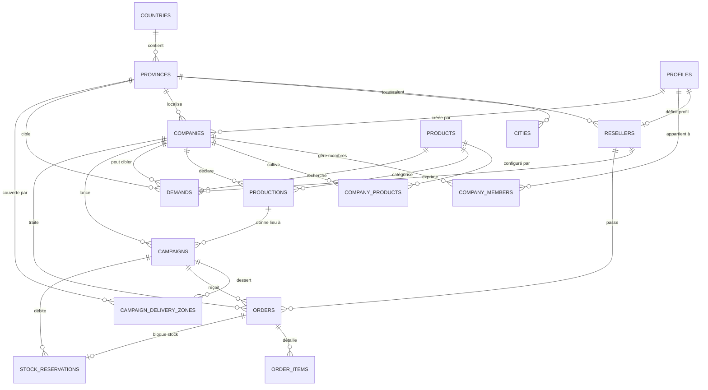

# MODÈLE RELATIONNEL ET STRUCTURE DES DONNÉES V1 IMPLÉMENTÉ (docs/data-model.md)
*Memory Bank — Plateforme Agricole V1 Expérimentale*
*Dernière mise à jour : 2026-09-09 — Phase 1 Validée et Déployée*

---

## 1. VUE D'ENSEMBLE DU MODÈLE RELATIONNEL IMPLÉMENTÉ

Le schéma relationnel déployé sur le projet Supabase/PostgreSQL **"Marché agricole"** isole strictement les 5 concepts clés du métier (`Produit`, `Production`, `Demande`, `Campagne`, `Commande` & `Réservation`) tout en garantissant l'intégrité référentielle, le cloisonnement des données, l'efficacité des index et la concurrence atomique des réservations.

---

## 2. DICTIONNAIRE DÉTAILLÉ DES 17 TABLES CRÉÉES

### 2.1 Référentiel Géographique

#### `countries`
* `id` : `UUID PRIMARY KEY DEFAULT gen_random_uuid()`
* `code` : `VARCHAR(3) NOT NULL UNIQUE` (ex. : `COD`)
* `name` : `VARCHAR(100) NOT NULL`
* `currency_code` : `VARCHAR(3) NOT NULL DEFAULT 'USD'`
* `is_active` : `BOOLEAN NOT NULL DEFAULT TRUE`
* `created_at` : `TIMESTAMPTZ NOT NULL DEFAULT NOW()`

#### `provinces`
* `id` : `UUID PRIMARY KEY DEFAULT gen_random_uuid()`
* `country_id` : `UUID NOT NULL REFERENCES countries(id) ON DELETE RESTRICT`
* `code` : `VARCHAR(10) NOT NULL` (ex. : `KIN`, `KAS`)
* `name` : `VARCHAR(100) NOT NULL`
* `created_at` : `TIMESTAMPTZ NOT NULL DEFAULT NOW()`
* *Contrainte* : `uq_provinces_country_name UNIQUE (country_id, name)`
* *Index* : `idx_provinces_country_id`

#### `cities`
* `id` : `UUID PRIMARY KEY DEFAULT gen_random_uuid()`
* `province_id` : `UUID NOT NULL REFERENCES provinces(id) ON DELETE CASCADE`
* `name` : `VARCHAR(100) NOT NULL`
* `created_at` : `TIMESTAMPTZ NOT NULL DEFAULT NOW()`
* *Contrainte* : `uq_cities_province_name UNIQUE (province_id, name)`
* *Index* : `idx_cities_province_id`

---

### 2.2 Identité et Acteurs

#### `profiles` (Extension de `auth.users`)
* `id` : `UUID PRIMARY KEY REFERENCES auth.users(id) ON DELETE CASCADE`
* `role` : `VARCHAR(20) NOT NULL CHECK (role IN ('company', 'reseller', 'admin'))`
* `full_name` : `VARCHAR(255) NOT NULL`
* `phone` : `VARCHAR(50)`
* `avatar_url` : `TEXT`
* `created_at`, `updated_at` : `TIMESTAMPTZ NOT NULL DEFAULT NOW()`
* *Trigger* : `trg_profiles_updated_at`

#### `companies` (Entreprises Agricoles)
* `id` : `UUID PRIMARY KEY DEFAULT gen_random_uuid()`
* `name` : `VARCHAR(255) NOT NULL`
* `slug` : `VARCHAR(255) NOT NULL UNIQUE`
* `description` : `TEXT`
* `logo_url` : `TEXT`
* `country_id` : `UUID NOT NULL REFERENCES countries(id) ON DELETE RESTRICT`
* `province_id` : `UUID NOT NULL REFERENCES provinces(id) ON DELETE RESTRICT`
* `city` : `VARCHAR(100)`
* `address` : `TEXT`
* `phone` : `VARCHAR(50)`
* `email` : `VARCHAR(255)`
* `verification_status` : `VARCHAR(30) NOT NULL DEFAULT 'pending' CHECK (verification_status IN ('pending', 'verified', 'rejected'))`
* `is_active` : `BOOLEAN NOT NULL DEFAULT TRUE`
* `created_by` : `UUID NOT NULL REFERENCES profiles(id) ON DELETE RESTRICT`
* `created_at`, `updated_at` : `TIMESTAMPTZ NOT NULL DEFAULT NOW()`
* *Index* : `idx_companies_province_id`, `idx_companies_created_by`, `idx_companies_verification_status`
* *Trigger* : `trg_companies_updated_at`

#### `company_members` (Collaborateurs)
* `id` : `UUID PRIMARY KEY DEFAULT gen_random_uuid()`
* `company_id` : `UUID NOT NULL REFERENCES companies(id) ON DELETE CASCADE`
* `user_id` : `UUID NOT NULL REFERENCES profiles(id) ON DELETE CASCADE`
* `role` : `VARCHAR(20) NOT NULL DEFAULT 'member' CHECK (role IN ('owner', 'admin', 'member'))`
* `created_at` : `TIMESTAMPTZ NOT NULL DEFAULT NOW()`
* *Contrainte* : `uq_company_members UNIQUE (company_id, user_id)`
* *Index* : `idx_company_members_user_id`, `idx_company_members_company_id`

#### `resellers` (Revendeurs)
* `id` : `UUID PRIMARY KEY REFERENCES profiles(id) ON DELETE CASCADE`
* `business_name` : `VARCHAR(255)`
* `country_id` : `UUID NOT NULL REFERENCES countries(id) ON DELETE RESTRICT`
* `province_id` : `UUID NOT NULL REFERENCES provinces(id) ON DELETE RESTRICT`
* `city` : `VARCHAR(100)`
* `delivery_address` : `TEXT`
* `reseller_type` : `VARCHAR(50) NOT NULL DEFAULT 'wholesaler' CHECK (reseller_type IN ('wholesaler', 'semi_wholesaler', 'retailer', 'processor'))`
* `created_at`, `updated_at` : `TIMESTAMPTZ NOT NULL DEFAULT NOW()`
* *Index* : `idx_resellers_province_id`, `idx_resellers_country_id`
* *Trigger* : `trg_resellers_updated_at`

---

### 2.3 Catalogue et Productions Agricoles

#### `products` (Catalogue Général & Produits Privés)
* `id` : `UUID PRIMARY KEY DEFAULT gen_random_uuid()`
* `name` : `VARCHAR(150) NOT NULL`
* `category` : `VARCHAR(100) NOT NULL`
* `description` : `TEXT`
* `default_unit` : `VARCHAR(30) NOT NULL DEFAULT 'tonne'`
* `image_url` : `TEXT` (Photo officielle si global, ou photo privée d'origine si créé par entreprise)
* `is_active` : `BOOLEAN NOT NULL DEFAULT TRUE`
* `is_global` : `BOOLEAN NOT NULL DEFAULT FALSE` (TRUE pour le catalogue officiel admin, FALSE pour les produits privés société)
* `created_by_company_id` : `UUID REFERENCES companies(id) ON DELETE CASCADE` (NULL pour les produits globaux officiels)
* `created_at`, `updated_at` : `TIMESTAMPTZ NOT NULL DEFAULT NOW()`
* *Contraintes & Index* :
  - `idx_products_global_name_unique` : `UNIQUE (LOWER(TRIM(name))) WHERE is_global = TRUE`
  - `idx_products_custom_name_unique` : `UNIQUE (created_by_company_id, LOWER(TRIM(name))) WHERE is_global = FALSE`
  - `idx_products_category`, `idx_products_is_active`, `idx_products_is_global`
* *Triggers* : `trg_products_updated_at`, `trg_protect_global_product_images` (interdit l'écrasement des images officielles)

#### `company_products` (Produits configurés par l'Entreprise)
* `id` : `UUID PRIMARY KEY DEFAULT gen_random_uuid()`
* `company_id` : `UUID NOT NULL REFERENCES companies(id) ON DELETE CASCADE`
* `product_id` : `UUID NOT NULL REFERENCES products(id) ON DELETE RESTRICT`
* `custom_name` : `VARCHAR(150)` (Dénomination d'exploitation / variété locale)
* `image_url` : `TEXT` (Photo personnalisée de l'entreprise — strictly distincte de l'image catalogue)
* `unit` : `VARCHAR(30)` (Unité propre à l'exploitation, par défaut hérite de `default_unit`)
* `notes` : `TEXT` (Notes agronomiques ou commerciales de l'exploitation)
* `description` : `TEXT`
* `is_active` : `BOOLEAN NOT NULL DEFAULT TRUE`
* `created_at`, `updated_at` : `TIMESTAMPTZ NOT NULL DEFAULT NOW()`
* *Contrainte* : `uq_company_products UNIQUE (company_id, product_id)`
* *Index* : `idx_company_products_company_id`, `idx_company_products_product_id`
* *Trigger* : `trg_company_products_updated_at`

#### `productions` (Cultures et Récoltes Déclarées)
* `id` : `UUID PRIMARY KEY DEFAULT gen_random_uuid()`
* `company_id` : `UUID NOT NULL REFERENCES companies(id) ON DELETE CASCADE`
* `product_id` : `UUID NOT NULL REFERENCES products(id) ON DELETE RESTRICT`
* `company_product_id` : `UUID REFERENCES company_products(id) ON DELETE SET NULL`
* `title` : `VARCHAR(255) NOT NULL`
* `description` : `TEXT`
* `main_image_url` : `TEXT NOT NULL`
* `location_name` : `VARCHAR(255) NOT NULL`
* `expected_quantity` : `NUMERIC(12,2) NOT NULL CHECK (expected_quantity > 0)`
* `unit` : `VARCHAR(30) NOT NULL DEFAULT 'tonne'`
* `period_start` : `DATE NOT NULL`
* `period_end` : `DATE`
* `status` : `VARCHAR(30) NOT NULL DEFAULT 'planned' CHECK (status IN ('draft', 'planned', 'growing', 'harvested', 'cancelled'))`
* `is_public` : `BOOLEAN NOT NULL DEFAULT TRUE`
* `created_at`, `updated_at` : `TIMESTAMPTZ NOT NULL DEFAULT NOW()`
* *Contrainte* : `chk_productions_period CHECK (period_end IS NULL OR period_end >= period_start)`
* *Index* : `idx_productions_company_id`, `idx_productions_product_id`, `idx_productions_status_public`, `idx_productions_period_start`
* *Trigger* : `trg_productions_updated_at`

---

### 2.4 Demandes et Analyse Territoriale

#### `demands` (Expressions de Besoin)
* `id` : `UUID PRIMARY KEY DEFAULT gen_random_uuid()`
* `reseller_id` : `UUID NOT NULL REFERENCES resellers(id) ON DELETE CASCADE`
* `product_id` : `UUID NOT NULL REFERENCES products(id) ON DELETE RESTRICT`
* `target_company_id` : `UUID REFERENCES companies(id) ON DELETE SET NULL`
* `quantity` : `NUMERIC(12,2) NOT NULL CHECK (quantity > 0)`
* `unit` : `VARCHAR(30) NOT NULL DEFAULT 'tonne'`
* `country_id` : `UUID NOT NULL REFERENCES countries(id) ON DELETE RESTRICT`
* `province_id` : `UUID NOT NULL REFERENCES provinces(id) ON DELETE RESTRICT`
* `city` : `VARCHAR(100)`
* `target_period_start` : `DATE`
* `target_period_end` : `DATE`
* `notes` : `TEXT`
* `status` : `VARCHAR(30) NOT NULL DEFAULT 'active' CHECK (status IN ('active', 'converted', 'cancelled', 'expired'))`
* `created_at`, `updated_at` : `TIMESTAMPTZ NOT NULL DEFAULT NOW()`
* *Contrainte* : `chk_demands_period CHECK (target_period_end IS NULL OR target_period_start IS NULL OR target_period_end >= target_period_start)`
* *Index* : `idx_demands_reseller_id`, `idx_demands_product_id`, `idx_demands_province_id`, `idx_demands_status`, `idx_demands_target_company`
* *Trigger* : `trg_demands_updated_at`

#### `v_market_demands_aggregated` (Vue SQL Décloisonnée)
Vue d'analyse macro calculée dynamiquement sur les demandes actives (`status = 'active'`) agrégées par `product_id`, `country_id`, `province_id`, `unit`. Accessible à toutes les entreprises.

---

### 2.5 Campagnes Commerciales et Zones Desservies

#### `campaigns` (Offres de Commercialisation)
* `id` : `UUID PRIMARY KEY DEFAULT gen_random_uuid()`
* `company_id` : `UUID NOT NULL REFERENCES companies(id) ON DELETE CASCADE`
* `production_id` : `UUID NOT NULL REFERENCES productions(id) ON DELETE RESTRICT`
* `product_id` : `UUID NOT NULL REFERENCES products(id) ON DELETE RESTRICT`
* `title` : `VARCHAR(255) NOT NULL`
* `description` : `TEXT`
* `marketable_quantity` : `NUMERIC(12,2) NOT NULL CHECK (marketable_quantity > 0)`
* `unit` : `VARCHAR(30) NOT NULL DEFAULT 'tonne'`
* `unit_price` : `NUMERIC(12,2) NOT NULL CHECK (unit_price > 0)`
* `currency` : `VARCHAR(3) NOT NULL DEFAULT 'USD'`
* `min_order_quantity` : `NUMERIC(12,2) DEFAULT 1 CHECK (min_order_quantity > 0)`
* `start_date` : `DATE NOT NULL`
* `end_date` : `DATE`
* `availability_period` : `VARCHAR(150)`
* `status` : `VARCHAR(30) NOT NULL DEFAULT 'draft' CHECK (status IN ('draft', 'active', 'paused', 'completed', 'cancelled'))`
* `created_at`, `updated_at` : `TIMESTAMPTZ NOT NULL DEFAULT NOW()`
* *Contrainte* : `chk_campaigns_dates CHECK (end_date IS NULL OR end_date >= start_date)`
* *Index* : `idx_campaigns_company_id`, `idx_campaigns_production_id`, `idx_campaigns_product_id`, `idx_campaigns_status`, `idx_campaigns_start_date`
* *Trigger* : `trg_campaigns_updated_at`

#### `campaign_delivery_zones` (Zones Provinciales Couvertes)
* `id` : `UUID PRIMARY KEY DEFAULT gen_random_uuid()`
* `campaign_id` : `UUID NOT NULL REFERENCES campaigns(id) ON DELETE CASCADE`
* `country_id` : `UUID NOT NULL REFERENCES countries(id) ON DELETE RESTRICT`
* `province_id` : `UUID NOT NULL REFERENCES provinces(id) ON DELETE RESTRICT`
* `created_at` : `TIMESTAMPTZ NOT NULL DEFAULT NOW()`
* *Contrainte* : `uq_campaign_delivery_zones UNIQUE (campaign_id, province_id)`
* *Index* : `idx_campaign_delivery_zones_campaign`, `idx_campaign_delivery_zones_province`

---

### 2.6 Commandes, Lignes Contractuelles, Réservations et Audit

#### `orders` (Entêtes de Commandes)
* `id` : `UUID PRIMARY KEY DEFAULT gen_random_uuid()`
* `order_number` : `VARCHAR(50) NOT NULL UNIQUE` (Format : `CMD-YYYYMMDD-XXXXXXXX`)
* `qr_code_token` : `VARCHAR(64) NOT NULL UNIQUE` (Token aléatoire cryptographique pour QR Code)
* `reseller_id` : `UUID NOT NULL REFERENCES resellers(id) ON DELETE RESTRICT`
* `company_id` : `UUID NOT NULL REFERENCES companies(id) ON DELETE RESTRICT`
* `campaign_id` : `UUID REFERENCES campaigns(id) ON DELETE RESTRICT`
* `origin_type` : `VARCHAR(30) NOT NULL DEFAULT 'direct_campaign' CHECK (origin_type IN ('direct_campaign', 'demand_response'))`
* `demand_response_id` : `UUID REFERENCES demand_responses(id) ON DELETE SET NULL`
* `production_id` : `UUID REFERENCES productions(id) ON DELETE SET NULL`
* `total_amount` : `NUMERIC(14,2) NOT NULL CHECK (total_amount > 0)`
* `currency` : `VARCHAR(3) NOT NULL DEFAULT 'USD'`
* `delivery_province_id` : `UUID NOT NULL REFERENCES provinces(id) ON DELETE RESTRICT`
* `delivery_city` : `VARCHAR(100)`
* `delivery_address` : `TEXT`
* `status` : `VARCHAR(30) NOT NULL DEFAULT 'pending' CHECK (status IN ('pending', 'confirmed', 'preparing', 'ready', 'delivered', 'cancelled'))`
* `delivered_at` : `TIMESTAMPTZ` (Horodatage de la remise physique)
* `delivered_quantity` : `NUMERIC(12,2)` (Quantité effectivement remise)
* `delivered_by` : `UUID REFERENCES profiles(id)` (Agent société ayant validé la livraison)
* `delivery_notes` : `TEXT` (Notes de livraison)
* `notes` : `TEXT`
* `created_at`, `updated_at` : `TIMESTAMPTZ NOT NULL DEFAULT NOW()`
* *Index* : `idx_orders_reseller_id`, `idx_orders_company_id`, `idx_orders_campaign_id`, `idx_orders_status`, `idx_orders_created_at`, `idx_orders_qr_code_token`
* *Trigger* : `trg_orders_updated_at`, `trg_order_qr_code_token`

#### `order_items` (Lignes de Commande)
* `id` : `UUID PRIMARY KEY DEFAULT gen_random_uuid()`
* `order_id` : `UUID NOT NULL REFERENCES orders(id) ON DELETE CASCADE`
* `product_id` : `UUID NOT NULL REFERENCES products(id) ON DELETE RESTRICT`
* `quantity` : `NUMERIC(12,2) NOT NULL CHECK (quantity > 0)`
* `unit` : `VARCHAR(30) NOT NULL`
* `unit_price` : `NUMERIC(12,2) NOT NULL CHECK (unit_price > 0)`
* `subtotal` : `NUMERIC(14,2) NOT NULL CHECK (subtotal > 0)`
* `created_at` : `TIMESTAMPTZ NOT NULL DEFAULT NOW()`
* *Index* : `idx_order_items_order_id`, `idx_order_items_product_id`

#### `stock_reservations` (Réservations Atomiques)
* `id` : `UUID PRIMARY KEY DEFAULT gen_random_uuid()`
* `campaign_id` : `UUID NOT NULL REFERENCES campaigns(id) ON DELETE CASCADE`
* `order_id` : `UUID NOT NULL UNIQUE REFERENCES orders(id) ON DELETE CASCADE`
* `quantity` : `NUMERIC(12,2) NOT NULL CHECK (quantity > 0)`
* `status` : `VARCHAR(30) NOT NULL DEFAULT 'active' CHECK (status IN ('active', 'released', 'confirmed'))`
* `created_at`, `updated_at` : `TIMESTAMPTZ NOT NULL DEFAULT NOW()`
* *Index* : `idx_stock_reservations_campaign_id`, `idx_stock_reservations_status`
* *Trigger* : `trg_stock_reservations_updated_at`

#### `audit_logs` (Journal d'Audit)
* `id` : `UUID PRIMARY KEY DEFAULT gen_random_uuid()`
* `actor_id` : `UUID REFERENCES profiles(id) ON DELETE SET NULL`
* `action` : `VARCHAR(50) NOT NULL`
* `entity_type` : `VARCHAR(50) NOT NULL`
* `entity_id` : `UUID NOT NULL`
* `details` : `JSONB`
* `created_at` : `TIMESTAMPTZ NOT NULL DEFAULT NOW()`
* *Index* : `idx_audit_logs_entity`, `idx_audit_logs_actor`, `idx_audit_logs_created_at`

---

## 3. PROCÉDURES TRANSACTIONNELLES RPC IMPLÉMENTÉES

### 3.1 `create_order_with_reservation(...)`
Fonction `SECURITY DEFINER` garantissant l'atomicité et l'absence totale de sur-réservation par verrouillage pessimiste (`SELECT ... FOR UPDATE`) :
1. Valide l'identité du demandeur (`auth.uid() = p_reseller_id`);
2. Verrouille la campagne cible (`FOR UPDATE`);
3. Valide le statut `active`;
4. Contrôle le minimum de commande (`p_quantity >= min_order_quantity`);
5. Contrôle l'éligibilité territoriale (`campaign_delivery_zones`);
6. Calcule le stock disponible actuel : $\text{marketable\_quantity} - \sum \text{quantity}_{\text{active}}$;
7. Refuse et lève une exception si stock insuffisant;
8. Insère atomiquement dans `orders`, `order_items`, `stock_reservations` et `audit_logs`;
9. Retourne l'`order_id`, `order_number`, `total_amount` et `reserved_quantity`.

### 3.2 `cancel_order_and_release_reservation(...)`
Fonction `SECURITY DEFINER` assurant la libération du stock :
1. Contrôle les permissions (revendeur acheteur, membre de l'entreprise ou administrateur);
2. Vérifie que la commande est en statut annulable (`pending` ou `confirmed`);
3. Bascule le statut de la commande à `cancelled`;
4. Bascule le statut de la réservation liée à `released`, réintégrant immédiatement le volume au stock disponible;
5. Consigne l'événement dans `audit_logs`.

### 3.3 `get_campaign_stock_summary(p_campaign_id UUID)`
Retourne `marketable_quantity`, `reserved_quantity` et `available_quantity`.
